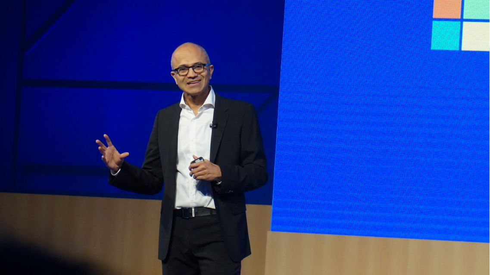

这本书是2019年读完的，读完之后就送给了妹子...导致现在写文章还得找个 PDF 版来找里面的内容

2016年的六一儿童节，我在北京的微软开发者大会上，有幸在台下坐着听他做开场的 Keynote 演讲。货真价实、如假包换的微软 CEO 就在离我不到10米的距离，特别震撼。另外我全程没有使用会场的同声传译，对自己的英语听力一直都很有自信。

只说说我感受最深的地方吧：

1. 萨提亚·纳德拉出生很优越，先天的环境加上后天自己的努力以及正确的选择，才走到了今天这个位置
2. 不得不承认他确实是一位非常优秀的人，带领微软成功转型，让 .NET 程序员的呼吸权延续了好几年
3. 他也是一位坚强的父亲，自己的一个孩子从出生开始就身体不好，到现在还得需要照顾，也是非常不容易
4. 他是真正微软内在文化建设的人，也是让外人都能感觉到微软这几年内表现的不一样；以前或许只是一个商业公司，而如今这个公司更加开放和包容（特指技术上包容）
5. 他做了很多正确的决定，让微软在复杂的商业环境中一直保持着自己的竞争力

