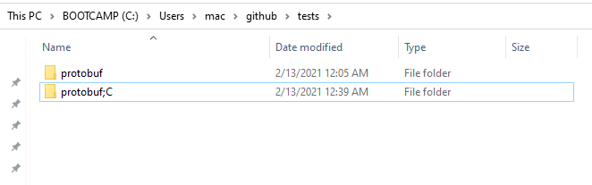
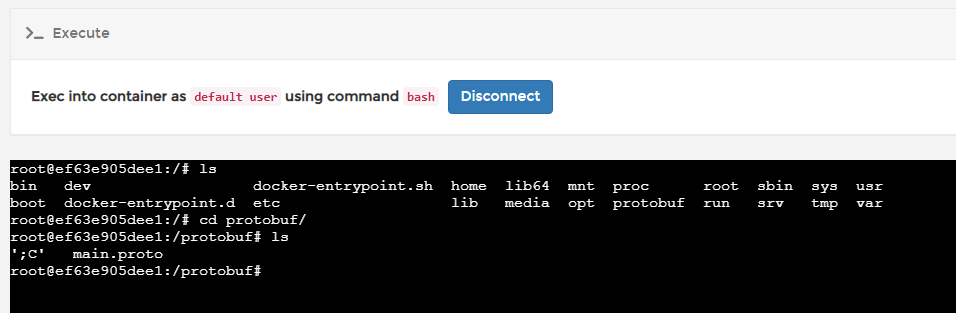

Docker容器启动的时候，如果要挂载宿主机的一个目录，可以用-v参数指定。

譬如我要启动一个centos容器，宿主机的/test目录挂载到容器的/soft目录，可通过以下方式指定：

\# docker run -it -v /test:/soft centos /bin/bash

设置环境变量：

export PWD="/c/Users/mac/github/tests/protobuf/"

映射驱动器：

docker run -v 本机路径:镜像内部的路径 镜像名称

在 Windows 基本上只能用普通 CMD 来操作路径映射，Git Bash总是会出问题（或者只能用别的方法）

docker run -v \~/github/tests/:/protobuf  nginx

Git Bash 效果如图，映射得很奇怪，而且没法使用

docker run -v C:\Users\mac\github\tests\protobuf:/protobuf nginx

用CMD执行，效果就很正确

最终可以运行的：

docker run --rm -v C:\Users\mac\github\tests\protobuf:/protobuf -w /protobuf jaegertracing/protobuf:latest --proto_path=/protobuf --java_out=/protobuf main.proto

Jaeger转换需要用到的命令

docker run --rm -v C:\Users\mac\github\jaeger-idl\proto\api_v2:/protobuf -w /protobuf jaegertracing/protobuf:latest --proto_path=/protobuf --csharp_out=/protobuf -I/usr/include/github.com/gogo/protobuf collector.proto