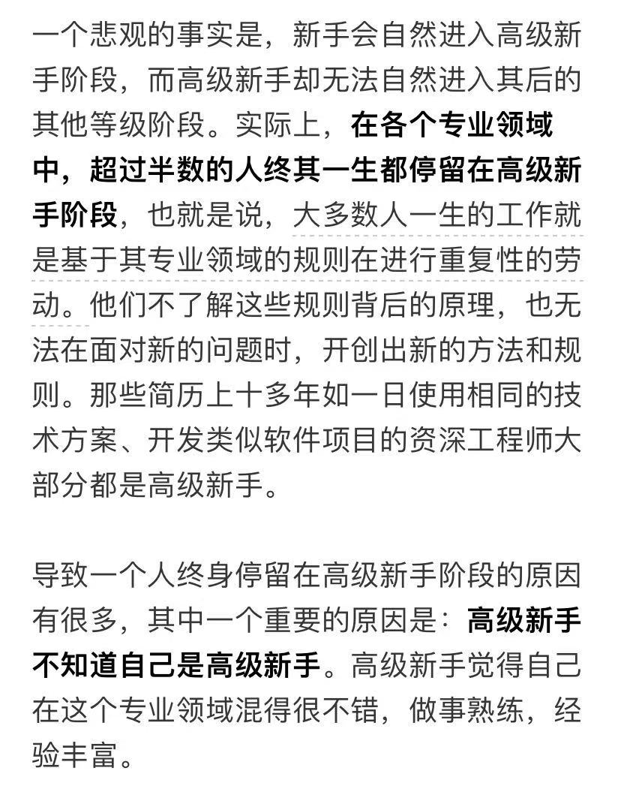
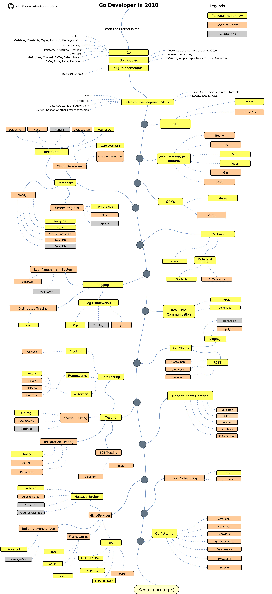

# 是时候从 Go 新手毕业，成为高级新手了

## 目前的状态

Go 的基础语法都已经学习完了，练习的代码也写了一些，但是都是基于语法的练习代码，写 LeetCode 的时候也都会用 Go 来做优先的编程语言。

但是情况不能一直持续下去，需要找到自己的突破口，就像一篇文章里面说到的，要成为高级新手。

那么，途径确实有很多，但是也要考虑到一个上升梯度问题。如果梯度太过陡峭，则对自信心和获得感都会造成不小的打击，最终结果可能是事倍功半。

## Part One：师父领进门

所以就参考了知乎的文章：[https://zhuanlan.zhihu.com/p/298390406](https://zhuanlan.zhihu.com/p/298390406)

### 真正的入门指南：the-way-to-go_ZH_CN

其实 Go 入门的文章也好，书也好，已经涉猎了不少。

但是真正的感觉是：纸上得来终觉浅，绝知此事要躬行

书读得再多，也是纸上谈兵，必须去不断得写代码实践，才能让自己有更深刻和直观的理解。

这本书的目录非常不错，以后可以当一个字典来快速查询相应的内容。

[阅读地址](https://link.zhihu.com/?target=https%3A//github.com/unknwon/the-way-to-go_ZH_CN/blob/master/eBook/directory.md)

### 从零开始学 Go Web 编程：build-web-application-with-golang

这本书和《the-way-to-go》有一些重合，可以挑自己需要的来阅读

[阅读地址](https://github.com/astaxie/build-web-application-with-golang/blob/master/zh/SUMMARY.md)

## Part Two：再上一层楼

### 七天用 Go 从零实现系列：7days-golang

- [7天用Go从零实现Web框架Gee教程](https://geektutu.com/post/gee.html) 
- [Go语言动手写Web框架 - Gee第一天 http.Handler](https://geektutu.com/post/gee-day1.html) 
- [Go语言动手写Web框架 - Gee第二天 上下文Context](https://geektutu.com/post/gee-day2.html) 
- [Go语言动手写Web框架 - Gee第三天 前缀树路由Router](https://geektutu.com/post/gee-day3.html) 
- [Go语言动手写Web框架 - Gee第四天 分组控制Group](https://geektutu.com/post/gee-day4.html) 
- [Go语言动手写Web框架 - Gee第五天 中间件Middleware](https://geektutu.com/post/gee-day5.html) 
- [Go语言动手写Web框架 - Gee第六天 模板(HTML Template)](https://geektutu.com/post/gee-day6.html) 
- [Go语言动手写Web框架 - Gee第七天 错误恢复(Panic Recover)](https://geektutu.com/post/gee-day7.html) 

这个是从0开始实现一个 Go Web 框架，值得动手实践去照着做一遍，应该会有很强的收获感，也能增加 Go 学习的自信心。

### Go 学习之路：golang-developer-roadmap

项目地址：[https://github.com/Alikhll/golang-developer-roadmap](https://github.com/Alikhll/golang-developer-roadmap)

### Go 高级编程：advanced-go-programming-book

[阅读地址](https://chai2010.cn/advanced-go-programming-book/)

## Part Three：是时候展示真正的技术了

### 星图：starcharts

[项目地址](https://link.zhihu.com/?target=https%3A//github.com/caarlos0/starcharts)

### 来 Chat 下：gochat

[项目地址](https://link.zhihu.com/?target=https%3A//github.com/LockGit/gochat)

###  给！拿去用：annie

[项目地址](https://link.zhihu.com/?target=https%3A//github.com/iawia002/annie)